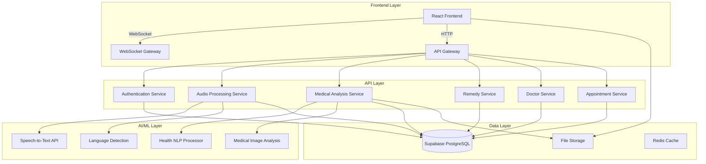

# Design Document: Village Health Assistant

## Overview

The Village Health Assistant is a comprehensive healthcare platform built with a modern microservices architecture. The system leverages FastAPI for backend services, React for the frontend, and Supabase for data persistence. The platform integrates multiple AI services including speech recognition, natural language processing, and computer vision to provide healthcare assistance to rural communities in their native languages.

The system follows a modular design with clear separation between audio processing, medical analysis, traditional remedies, doctor recommendations, and appointment management. Each component is designed to be scalable, maintainable, and compliant with healthcare data privacy requirements.

## Architecture

### High-Level Architecture



### Service Architecture

The system is organized into microservices, each handling specific domain responsibilities:

1. **Authentication Service**: User management, session handling, and security
2. **Audio Processing Service**: Speech-to-text conversion and language detection
3. **Medical Analysis Service**: Health information processing and AI analysis
4. **Remedy Service**: Traditional remedy database and recommendation engine
5. **Doctor Service**: Doctor profiles, ratings, and recommendation algorithms
6. **Appointment Service**: Scheduling, booking, and calendar management

## Components and Interfaces

### Frontend Components

**Technology Stack**: React, Zustand (state management), Tailwind CSS, ShadCN UI

**Core Components**:
- `AudioRecorder`: Handles voice input with native language support
- `HealthAnalysis`: Displays AI-generated health insights and recommendations
- `ImageUploader`: Medical image upload and analysis interface
- `RemedySearch`: Traditional remedy search and display
- `DoctorRecommendations`: Doctor listing with ratings and booking
- `AppointmentManager`: Calendar and appointment management
- `MedicalHistory`: User health records and report viewer

**State Management**:
```typescript
interface AppState {
  user: UserProfile | null;
  currentSession: HealthSession | null;
  medicalHistory: MedicalRecord[];
  appointments: Appointment[];
  language: SupportedLanguage;
}
```

### Backend Services

**FastAPI Service Structure**:

**Authentication Service**:
```python
class AuthService:
    async def authenticate_user(token: str) -> User
    async def create_session(user_id: str) -> Session
    async def validate_permissions(user_id: str, resource: str) -> bool
```

**Audio Processing Service**:
```python
class AudioProcessor:
    async def process_audio(audio_data: bytes, language: str) -> AudioAnalysis
    async def detect_language(audio_data: bytes) -> str
    async def convert_to_text(audio_data: bytes, language: str) -> str
```

**Medical Analysis Service**:
```python
class MedicalAnalyzer:
    async def analyze_symptoms(text: str, language: str) -> HealthAnalysis
    async def process_medical_image(image: bytes) -> ImageAnalysis
    async def generate_recommendations(analysis: HealthAnalysis) -> Recommendations
```

### API Endpoints

**Core API Routes**:

```
POST /api/v1/auth/login
POST /api/v1/auth/logout
GET  /api/v1/auth/profile

POST /api/v1/sessions/new
GET  /api/v1/sessions/{session_id}
DELETE /api/v1/sessions/{session_id}

POST /api/v1/audio/process
POST /api/v1/audio/analyze
GET  /api/v1/audio/languages

POST /api/v1/medical/analyze-text
POST /api/v1/medical/analyze-image
GET  /api/v1/medical/history/{user_id}
POST /api/v1/medical/reports/generate

GET  /api/v1/remedies/search
GET  /api/v1/remedies/{remedy_id}
POST /api/v1/remedies/check-allergies

GET  /api/v1/doctors/search
GET  /api/v1/doctors/{doctor_id}
POST /api/v1/doctors/recommend

POST /api/v1/appointments/book
GET  /api/v1/appointments/{user_id}
PUT  /api/v1/appointments/{appointment_id}
DELETE /api/v1/appointments/{appointment_id}
```

**WebSocket Endpoints**:
```
/ws/audio-stream/{session_id}  # Real-time audio processing
/ws/notifications/{user_id}    # Appointment and health alerts
```

## Data Models

### Core Data Structures

**User Profile**:
```sql
CREATE TABLE users (
    id UUID PRIMARY KEY DEFAULT gen_random_uuid(),
    phone_number VARCHAR(15) UNIQUE NOT NULL,
    preferred_language VARCHAR(10) NOT NULL,
    location JSONB,
    allergies TEXT[],
    emergency_contact JSONB,
    created_at TIMESTAMP WITH TIME ZONE DEFAULT NOW(),
    updated_at TIMESTAMP WITH TIME ZONE DEFAULT NOW()
);
```

**Health Session**:
```sql
CREATE TABLE health_sessions (
    id UUID PRIMARY KEY DEFAULT gen_random_uuid(),
    user_id UUID REFERENCES users(id),
    audio_transcript TEXT,
    detected_language VARCHAR(10),
    analysis_result JSONB,
    recommendations JSONB,
    status VARCHAR(20) DEFAULT 'active',
    created_at TIMESTAMP WITH TIME ZONE DEFAULT NOW()
);
```

**Medical Records**:
```sql
CREATE TABLE medical_records (
    id UUID PRIMARY KEY DEFAULT gen_random_uuid(),
    user_id UUID REFERENCES users(id),
    session_id UUID REFERENCES health_sessions(id),
    record_type VARCHAR(50), -- 'audio_analysis', 'image_analysis', 'prescription'
    content JSONB,
    attachments TEXT[],
    doctor_id UUID REFERENCES doctors(id),
    created_at TIMESTAMP WITH TIME ZONE DEFAULT NOW()
);
```

**Doctors**:
```sql
CREATE TABLE doctors (
    id UUID PRIMARY KEY DEFAULT gen_random_uuid(),
    name VARCHAR(255) NOT NULL,
    specialization VARCHAR(100),
    location JSONB,
    rating DECIMAL(3,2),
    working_hours JSONB,
    contact_info JSONB,
    languages VARCHAR(10)[],
    verified BOOLEAN DEFAULT FALSE,
    created_at TIMESTAMP WITH TIME ZONE DEFAULT NOW()
);
```

**Traditional Remedies**:
```sql
CREATE TABLE remedies (
    id UUID PRIMARY KEY DEFAULT gen_random_uuid(),
    name VARCHAR(255) NOT NULL,
    description TEXT,
    ingredients TEXT[],
    preparation_steps TEXT[],
    conditions TEXT[],
    contraindications TEXT[],
    language VARCHAR(10),
    region VARCHAR(100),
    verified BOOLEAN DEFAULT FALSE,
    created_at TIMESTAMP WITH TIME ZONE DEFAULT NOW()
);
```

**Appointments**:
```sql
CREATE TABLE appointments (
    id UUID PRIMARY KEY DEFAULT gen_random_uuid(),
    user_id UUID REFERENCES users(id),
    doctor_id UUID REFERENCES doctors(id),
    session_id UUID REFERENCES health_sessions(id),
    scheduled_time TIMESTAMP WITH TIME ZONE,
    status VARCHAR(20) DEFAULT 'scheduled',
    notes TEXT,
    created_at TIMESTAMP WITH TIME ZONE DEFAULT NOW()
);
```

### Data Relationships

- Users have multiple health sessions and medical records
- Each health session can generate multiple medical records
- Doctors can have multiple appointments with different users
- Remedies are categorized by conditions and regions
- Medical records can be linked to appointments for continuity of care

## Correctness Properties

*A property is a characteristic or behavior that should hold true across all valid executions of a system—essentially, a formal statement about what the system should do. Properties serve as the bridge between human-readable specifications and machine-verifiable correctness guarantees.*

### Core System Properties

**Property 1: Session Uniqueness**
*For any* sequence of session creation requests, all generated session identifiers should be unique and audio recording capabilities should be properly initialized
**Validates: Requirements 1.1**

**Property 2: Audio Processing Completeness**
*For any* valid audio input in supported languages, the system should produce text output with correct language detection
**Validates: Requirements 1.2, 7.1**

**Property 3: Health Analysis JSON Structure**
*For any* health analysis request, the generated JSON response should contain all required fields: main problem identification, cause analysis, preventive measures, and conditionally community solutions when recommended
**Validates: Requirements 1.3, 1.4, 1.5, 1.6, 1.7**

**Property 4: Doctor Recommendation Completeness**
*For any* doctor recommendation request, the system should return exactly 3 doctors with complete information including location, ratings, working hours, and booking functionality
**Validates: Requirements 1.8, 4.4, 4.5, 4.6**

**Property 5: Medical Image Analysis Consistency**
*For any* valid medical image upload, the system should process the image and generate a JSON response with exactly 5 identified medical problems and appropriate call-to-action recommendations
**Validates: Requirements 2.1, 2.2, 2.3**

**Property 6: Medical Data Persistence**
*For any* completed health consultation or medical analysis, the system should persist all medical information to the user's profile and maintain it across multiple sessions
**Validates: Requirements 2.5, 5.1, 5.4**

**Property 7: Doctor Information Sharing**
*For any* doctor selection or appointment confirmation, the system should transmit complete medical background and symptom information to the selected doctor
**Validates: Requirements 2.4, 6.5**

**Property 8: Remedy Safety Validation**
*For any* remedy recommendation, the system should cross-check against user allergies and exclude conflicting remedies while validating safety through AI analysis
**Validates: Requirements 3.2, 3.3, 3.5**

**Property 9: Remedy Search Completeness**
*For any* valid remedy search query, the system should return comprehensive and relevant traditional solutions for the searched condition
**Validates: Requirements 3.1, 3.4**

**Property 10: Doctor Recommendation Algorithm**
*For any* doctor recommendation request, the system should prioritize based on medical condition, consider past interactions, and rank by location proximity
**Validates: Requirements 4.1, 4.2, 4.3**

**Property 11: Medical Report Generation**
*For any* medical report request, the system should generate valid PDF documents with curated health information and ensure prescription accessibility
**Validates: Requirements 5.2, 5.6**

**Property 12: Medical History Accessibility**
*For any* user profile access, the system should display complete medical history, latest reports, and provide comprehensive information for doctor sharing
**Validates: Requirements 5.3, 5.5**

**Property 13: Appointment Management Completeness**
*For any* appointment-related action, the system should provide full functionality including viewing available slots, booking with confirmation, and supporting management operations (view, reschedule, cancel)
**Validates: Requirements 6.1, 6.2, 6.3, 6.4**

**Property 14: Language Consistency**
*For any* user interaction, the system should maintain consistent language throughout the session and present all information in the user's preferred language with proper localization
**Validates: Requirements 7.2, 7.3, 7.4**

**Property 15: Text-to-Speech Functionality**
*For any* supported language, the system should provide text-to-speech capabilities for audio responses
**Validates: Requirements 7.5**

**Property 16: Data Encryption and Security**
*For any* stored user data, the system should encrypt all medical information and personal details
**Validates: Requirements 8.1**

**Property 17: Access Control and Consent**
*For any* data access or sharing operation, the system should enforce proper authentication, authorization, and require explicit user consent for doctor information sharing
**Validates: Requirements 8.2, 8.3**

**Property 18: Data Deletion Capability**
*For any* user data deletion request, the system should provide secure data removal options
**Validates: Requirements 8.5**

**Property 19: Photo Upload for Consultations**
*For any* scheduled appointment requiring further consultation, the system should allow photo uploads for doctor review
**Validates: Requirements 2.6**

## Error Handling

### Error Categories and Responses

**Audio Processing Errors**:
- Invalid audio format: Return structured error with supported formats
- Language detection failure: Default to fallback language with user notification
- Speech-to-text failure: Provide retry mechanism with alternative input methods

**Medical Analysis Errors**:
- Insufficient health information: Request additional details from user
- Image processing failure: Validate image format and quality requirements
- AI service unavailability: Queue requests and provide estimated processing time

**Database Errors**:
- Connection failures: Implement retry logic with exponential backoff
- Data corruption: Validate data integrity and provide recovery mechanisms
- Storage limits: Implement data archiving and cleanup policies

**Authentication Errors**:
- Invalid credentials: Provide clear error messages without exposing system details
- Session expiration: Automatic renewal with user notification
- Permission denied: Log security events and provide appropriate user feedback

**Integration Errors**:
- Third-party service failures: Implement circuit breaker patterns
- API rate limiting: Queue requests and implement backoff strategies
- Network timeouts: Retry with progressive timeout increases

### Error Recovery Strategies

1. **Graceful Degradation**: Core functionality remains available even when auxiliary services fail
2. **Data Consistency**: Ensure partial failures don't leave data in inconsistent states
3. **User Communication**: Provide clear, actionable error messages in user's preferred language
4. **Logging and Monitoring**: Comprehensive error tracking for system health monitoring
5. **Automatic Recovery**: Self-healing mechanisms for transient failures

## Testing Strategy

### Dual Testing Approach

The system will employ both unit testing and property-based testing to ensure comprehensive coverage:

**Unit Tests**:
- Specific examples demonstrating correct behavior
- Edge cases and error conditions
- Integration points between components
- API endpoint validation with known inputs

**Property-Based Tests**:
- Universal properties verified across randomized inputs
- Minimum 100 iterations per property test
- Each test tagged with: **Feature: village-health-assistant, Property {number}: {property_text}**
- Comprehensive input coverage through intelligent test data generation

### Property-Based Testing Configuration

**Testing Framework**: Hypothesis (Python) for backend services, fast-check (TypeScript) for frontend components

**Test Data Generators**:
- Audio data generators for multiple languages and quality levels
- Medical image generators with various formats and conditions
- User profile generators with diverse demographics and medical histories
- Remedy database generators with different cultural backgrounds

**Property Test Examples**:
```python
@given(audio_data=audio_generator(), language=language_generator())
def test_audio_processing_completeness(audio_data, language):
    """Feature: village-health-assistant, Property 2: Audio Processing Completeness"""
    result = audio_processor.process(audio_data, language)
    assert result.text is not None
    assert result.detected_language in SUPPORTED_LANGUAGES
    assert len(result.text) > 0

@given(health_analysis=health_analysis_generator())
def test_json_structure_completeness(health_analysis):
    """Feature: village-health-assistant, Property 3: Health Analysis JSON Structure"""
    json_response = generate_health_response(health_analysis)
    assert "main_problem" in json_response
    assert "cause_analysis" in json_response
    assert "preventive_measures" in json_response
    if json_response.get("community_recommended"):
        assert "community_solutions" in json_response
```

### Integration Testing

**End-to-End Scenarios**:
- Complete user journey from audio input to doctor appointment
- Medical image upload and analysis workflow
- Traditional remedy search and safety validation
- Multi-language user experience validation

**Performance Testing**:
- Audio processing latency under various loads
- Medical image analysis throughput
- Database query performance with large datasets
- Concurrent user session handling

### Security Testing

**Data Protection Validation**:
- Encryption verification for stored medical data
- Access control enforcement testing
- Consent mechanism validation
- Data deletion completeness verification

**Compliance Testing**:
- HIPAA compliance validation (with Supabase BAA)
- Data privacy regulation adherence
- Audit trail completeness
- Security incident response procedures